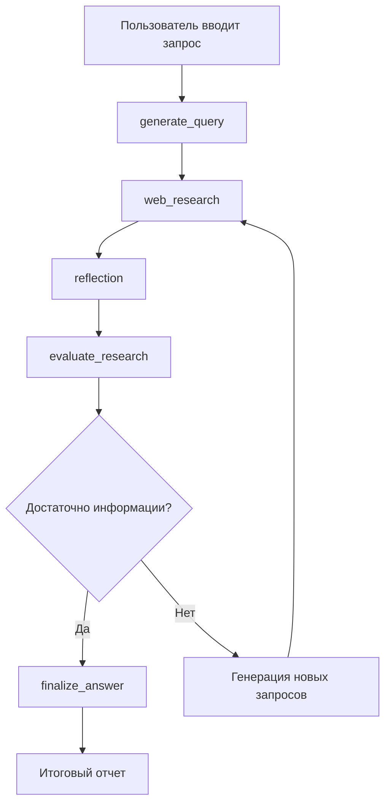

# Gemini Fullstack Research Agent с LangGraph

**Gemini Fullstack Research Agent** - это продвинутый исследовательский агент, построенный на LangGraph с фронтендом на React. Проект использует Vertex AI для интеллектуального поиска и анализа информации в интернете.

## 🚀 Основные возможности

- **🧠 Интеллектуальный поиск**: Использует Gemini для формирования стратегии исследования
- **🔄 Итеративный процесс**: Автоматически анализирует результаты и формирует новые запросы
- **🎯 Адаптивная логика**: Останавливается при достижении достаточного количества информации
- **📊 Веб-интерфейс**: Современный React-интерфейс для взаимодействия с агентом
- **⚡ LangGraph**: Построен на современном фреймворке для создания агентов
- **🔒 Vertex AI**: Использует Google Cloud Vertex AI для максимальной производительности

## 🏗️ Архитектура

Проект состоит из двух основных компонентов:

### Frontend (React + TypeScript)
- Современный интерфейс с компонентами на Tailwind CSS
- Реальное время взаимодействия с LangGraph API
- Отображение прогресса исследования и результатов

### Backend (LangGraph + Vertex AI)
- **LangGraph граф** с узлами для различных этапов исследования
- **Vertex AI интеграция** для обработки естественного языка
- **Веб-поиск** через Google Search API
- **Итеративная логика** для глубокого анализа

## 📋 Предварительные требования

- **Python 3.10+**
- **Node.js 18+**
- **uv** (для управления зависимостями Python)
- **Google Cloud Project** с включенным Vertex AI API
- **Google Cloud SDK** для аутентификации

## 🚀 Быстрый старт

### 1. Клонирование репозитория
```bash
git clone https://github.com/Revolx1/gemini-fullstack.git
cd gemini-fullstack
```

### 2. Настройка окружения
```bash
# Аутентификация с Google Cloud
gcloud auth application-default login
gcloud config set project YOUR_PROJECT_ID
```

### 3. Настройка backend
```bash
cd langgraph_backend
cp .env.example .env
# Отредактируйте .env файл с вашими настройками
```

### 4. Запуск приложения
```bash
# Из корневой папки проекта
make install && make dev
```

Приложение будет доступно по адресу `http://localhost:5173`

## 🔧 Настройка

### Переменные окружения

Создайте файл `.env` в папке `langgraph_backend`:

```env
# Google Cloud настройки
GOOGLE_CLOUD_PROJECT=your-project-id
GOOGLE_CLOUD_REGION=us-central1

# Настройки поиска
GOOGLE_SEARCH_API_KEY=your-search-api-key
GOOGLE_SEARCH_ENGINE_ID=your-search-engine-id

# Настройки LangGraph
LANGGRAPH_API_HOST=0.0.0.0
LANGGRAPH_API_PORT=8000
```

### Конфигурация исследования

Основные параметры настраиваются в `langgraph_backend/src/agent/configuration.py`:

```python
class Configuration(BaseModel):
    """Конфигурация для исследовательского агента."""
    
    # Количество начальных поисковых запросов
    number_of_initial_queries: int = Field(default=30)
    
    # Максимальное количество циклов исследования
    max_research_loops: int = Field(default=50)
    
    # Модель для различных задач
    model: str = Field(default="gemini-1.5-pro")
    search_model: str = Field(default="gemini-1.5-flash")
```

## 📊 Как работает агент

### Граф исследования



### Основные узлы графа

1. **generate_query**: Генерирует начальные поисковые запросы
2. **web_research**: Выполняет поиск в интернете
3. **reflection**: Анализирует найденную информацию
4. **evaluate_research**: Принимает решение о продолжении исследования
5. **finalize_answer**: Формирует итоговый отчет

## 🎯 Использование

### Через веб-интерфейс
1. Откройте `http://localhost:5173`
2. Введите ваш исследовательский запрос
3. Наблюдайте за процессом исследования в реальном времени
4. Получите детальный отчет с источниками

### Через CLI
```bash
cd langgraph_backend/examples
python cli_research.py "Ваш исследовательский запрос" --initial-queries 30 --max-loops 50
```

## 🔍 Troubleshooting

### Проблема с recursion_limit
Если процесс останавливается с ошибкой `GraphRecursionError`, увеличьте лимит рекурсии:

```python
# В client коде
config = {
    "configurable": {"server_log_path": "logs/"},
    "recursion_limit": 150  # Увеличьте для больших исследований
}
```

### Проблемы с аутентификацией
Убедитесь, что:
- Выполнена команда `gcloud auth application-default login`
- Установлен правильный PROJECT_ID
- Включен Vertex AI API в вашем проекте

## 🛠️ Разработка

### Структура проекта
```
gemini-fullstack/
├── frontend/                 # React приложение
│   ├── src/
│   │   ├── components/      # UI компоненты
│   │   └── App.tsx         # Главный компонент
├── langgraph_backend/       # LangGraph сервер
│   ├── src/agent/          # Логика агента
│   │   ├── graph.py        # Определение графа
│   │   ├── prompts.py      # Промпты для моделей
│   │   └── configuration.py # Настройки
│   └── examples/           # Примеры использования
└── app/                    # Простой Flask API (опционально)
```

### Добавление новых узлов в граф

```python
# В graph.py
def your_custom_node(state: ResearchState, config: RunnableConfig) -> ResearchState:
    """Ваш кастомный узел."""
    # Логика узла
    return state

# Добавление в граф
builder.add_node("your_node", your_custom_node)
builder.add_edge("previous_node", "your_node")
```

## 📈 Мониторинг

Логи исследования сохраняются в папке `outputs/` с временными метками. Каждый запуск создает:
- `research_YYYYMMDD.txt` - основной лог
- `research_YYYYMMDD.client.tmp` - детальные логи клиента

## 🤝 Вклад в проект

1. Форкните репозиторий
2. Создайте feature branch (`git checkout -b feature/amazing-feature`)
3. Закоммитьте изменения (`git commit -m 'Add amazing feature'`)
4. Запушьте в branch (`git push origin feature/amazing-feature`)
5. Создайте Pull Request

## 📄 Лицензия

Этот проект распространяется под лицензией MIT. См. файл `LICENSE` для подробностей.

## 🔗 Полезные ссылки

- [LangGraph Documentation](https://langchain-ai.github.io/langgraph/)
- [Vertex AI](https://cloud.google.com/vertex-ai)
- [React](https://reactjs.org/)
- [Tailwind CSS](https://tailwindcss.com/)
